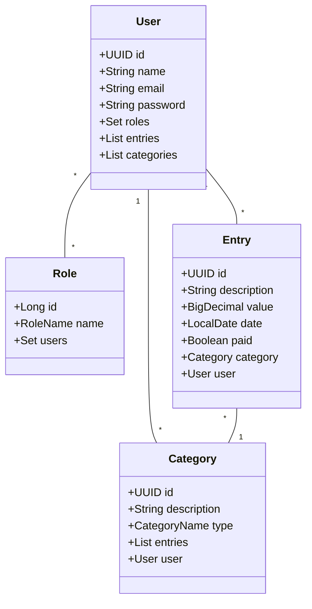

# 📊 API de Gerenciamento de Finanças Pessoais - fintrack

Este projeto é uma **API RESTful** desenvolvida com **Java 21** e **Spring Boot**, voltada ao controle de **despesas e receitas pessoais** de usuários. Cada usuário possui sua própria conta, onde pode registrar, consultar, atualizar e excluir seus lançamentos financeiros. Além disso, é possível importar e exportar dados em **formato CSV e XLSX**.

## 🔎 Interface Swagger UI

Abaixo, uma prévia da documentação gerada automaticamente com Swagger OpenAPI:


---

## 📘 Diagrama de Classes



---

## ✅ Funcionalidades

- Registro de **receitas** e **despesas** por usuário autenticado
- Autenticação com **JWT** e suporte a **Refresh Token**
- Exportação e importação de lançamentos:
  - 📤 CSV (`.csv`)
  - 📤 XLSX (`.xlsx`)
  - 📤 PDF (`.pdf`)
- Cache com **Redis** para otimização de performance
- Integração com **PostgreSQL 16** e versionamento de banco com **Flyway**
- Documentação interativa da API com **Swagger OpenAPI**
- Testes automatizados com **JUnit** e **Mockito**
- Separação de responsabilidades utilizando os princípios **SOLID** e boas práticas de **Clean Code**
- Uso de **Design Patterns** como Factory e Strategy
- Containerização com **Docker** e **Docker Compose**
- Conversão de objetos com **MapStruct**

---

## 🛠️ Tecnologias e Ferramentas

| Categoria             | Ferramentas                                               |
|-----------------------|-----------------------------------------------------------|
| Linguagem             | Java 21                                                   |
| Framework             | Spring Boot, Spring JPA, Spring Security                  |
| Banco de Dados        | PostgreSQL 16                                             |
| Autenticação          | JWT, Refresh Token                                        |
| Armazenamento Cache   | Redis                                                     |
| Versionamento DB      | Flyway                                                    |
| Documentação          | Swagger OpenAPI                                           |
| Mapeamento de Objetos | MapStruct                                                 |
| Testes                | JUnit, Mockito                                            |
| Importação/Exportação| Apache POI (XLSX), Commons CSV (CSV) e JasperReports (PDF) |
| Design Patterns       | Factory, Strategy                                         |
| Boas práticas         | SOLID, Clean Code                                         |
| Containerização       | Docker, Docker Compose                                    |

---

## 🧪 Testes

A cobertura de testes é garantida com o uso de:
- **JUnit 5** para testes unitários
- **Mockito** para simulação de dependências
- Testes de repositório e serviços

---

## 🔐 Autenticação

- Utiliza **Spring Security** com autenticação baseada em **JWT**.
- Requisições protegidas exigem token válido no cabeçalho `Authorization`.
- Suporte à renovação de token via **Refresh Token**.

---

## 🔄 Importação/Exportação

- Arquivos **CSV**, **XLSX** e **PDF** podem ser **exportados** para salvar os lançamentos financeiros do usuário.
- Arquivos CSV e XLSX também podem ser **importados** para cadastrar múltiplos lançamentos de uma vez.

---

## 📦 Execução com Docker

Você pode subir o projeto com Docker Compose:

```bash
docker-compose up --build
```

A aplicação estará disponível em: http://localhost:8080

📚 Documentação da API
Acesse a documentação Swagger:

http://localhost:8080/swagger-ui.html
